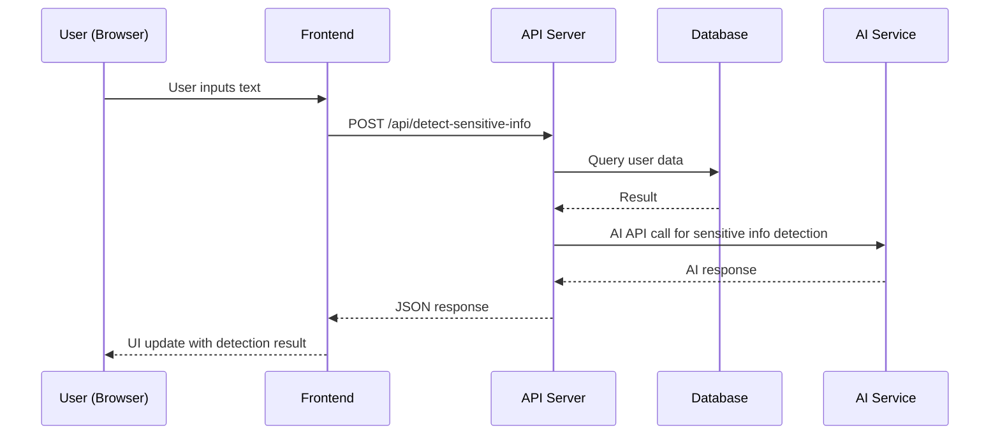
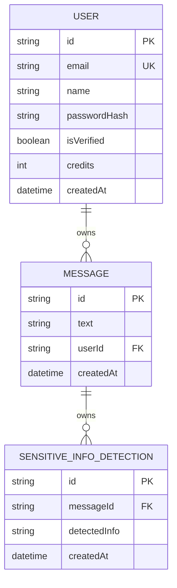

# Data Leak Prevention Chatbot
### MVP Architecture Document
> **Team:** talha · **Duration:** 32 weeks · **Stack:** scikit-learn, Hugging Face, Python, TensorFlow

---

## 1. Executive Summary
The Data Leak Prevention Chatbot is designed to detect and prevent sensitive company information from being shared through chatbots. This chatbot utilizes natural language processing (NLP) and machine learning algorithms to identify confidential data and alert the user. The primary goal is to provide a secure and reliable solution to prevent data leaks, thereby protecting company confidentiality. The chatbot will integrate with popular chatbot platforms to maximize its reach and effectiveness.

The chatbot will offer a user-friendly interface where employees can interact with it, and it will detect any sensitive information being shared. If such information is detected, the chatbot will alert the user and prevent the information from being shared. The chatbot will also provide feedback to the user on how to handle sensitive information securely.

## 2. System Architecture Overview

### 2.1 High-Level Architecture Diagram
```
┌─────────────────────────────────┐
│         React / Next.js         │  
└────────────┬────────────────────┘
             │ HTTPS / REST
┌────────────▼────────────────────┐
│      Express.js API Server      │
│  ┌──────────┐  ┌─────────────┐  │
│  │  Routes  │  │  Middleware │  │
│  └──────────┘  └─────────────┘  │
│  ┌──────────────────────────┐   │
│  │     Service Layer        │   │
│  └──────────────────────────┘   │
└───┬──────────────┬──────────────┘
    │              │
┌───▼───┐    ┌─────▼──────┐
│MongoDB│    │ Hugging Face │
│ Atlas │    │ AI Service  │
└───────┘    └────────────┘
```

### 2.2 Request Flow Diagram (Mermaid)


### 2.3 Architecture Pattern
The architecture pattern used for this project is a layered architecture, consisting of a frontend, API server, service layer, and database. This pattern suits the team size and timeline as it allows for a clear separation of concerns and facilitates development and testing.

### 2.4 Component Responsibilities
The frontend component is responsible for user interaction and rendering the UI. It does not own the business logic or database interactions. The API server component handles API requests and interacts with the service layer. The service layer owns the business logic and database interactions. The database component stores and retrieves data.

## 3. Tech Stack & Justification

| Layer | Technology | Why chosen |
|-------|-----------|------------|
| Frontend | React / Next.js | For its performance, scalability, and ease of development |
| API Server | Express.js | For its simplicity, flexibility, and extensive ecosystem |
| Service Layer | Python | For its simplicity, readability, and extensive libraries (scikit-learn, TensorFlow) |
| Database | MongoDB | For its flexibility, scalability, and ease of use |
| AI Service | Hugging Face | For its extensive library of pre-trained models and ease of use |

## 4. Database Design

### 4.1 Entity-Relationship Diagram


### 4.2 Relationship & Association Details
The relationship between User and Message is one-to-many, as a user can have multiple messages. The relationship between Message and SensitiveInfoDetection is one-to-many, as a message can have multiple sensitive info detections. The join strategy is to use the userId and messageId fields to join the tables. The cascade behavior on delete is to delete the associated messages and sensitive info detections when a user is deleted.

### 4.3 Schema Definitions (Code)
```typescript
const userSchema = new mongoose.Schema({
  email: { type: String, required: true, unique: true, lowercase: true },
  name: { type: String, required: true },
  passwordHash: { type: String, required: true },
  isVerified: { type: Boolean, default: false },
  credits: { type: Number, default: 0 },
  createdAt: { type: Date, default: Date.now },
});

const messageSchema = new mongoose.Schema({
  text: { type: String, required: true },
  userId: { type: mongoose.Schema.Types.ObjectId, ref: 'User', required: true },
  createdAt: { type: Date, default: Date.now },
});

const sensitiveInfoDetectionSchema = new mongoose.Schema({
  messageId: { type: mongoose.Schema.Types.ObjectId, ref: 'Message', required: true },
  detectedInfo: { type: String, required: true },
  createdAt: { type: Date, default: Date.now },
});
```

## 5. API Design

### 5.1 Authentication & Authorization
The API uses JWT authentication. The user sends a POST request to /api/login with their email and password, and the API responds with a JWT token. The user then includes the JWT token in the Authorization header of subsequent requests.

### 5.2 REST Endpoints
| Method | Path | Auth | Request Body | Response | Description |
|--------|------|------|--------------|----------|-------------|
| POST | /api/login | No | { email, password } | { token } | Login user |
| POST | /api/detect-sensitive-info | Yes | { text } | { detectedInfo } | Detect sensitive info in text |

### 5.3 Error Handling
The API uses a standard error response format, which includes an error code, message, and details.

## 6. Frontend Architecture

### 6.1 Folder Structure
The src/ directory tree has the following structure:
```bash
src/
components/
ui/
containers/
...
pages/
...
routes/
...
...
```
Each folder has a specific responsibility, such as components for reusable UI components, containers for components that manage state, pages for individual pages, and routes for routing configuration.

### 6.2 State Management
The frontend uses React Context API for global state management. The state is stored in the App component and passed down to child components as needed.

### 6.3 Key Pages & Components
The main page is the ChatPage component, which renders the chat interface and handles user input. The DetectSensitiveInfo component handles the detection of sensitive information and displays the result.

## 7. Core Feature Implementation

### 7.1 Sensitive Information Detection
The user flow for this feature is as follows: the user inputs text, and the frontend sends a POST request to /api/detect-sensitive-info with the text. The API server then calls the AI service to detect sensitive information in the text. The AI service responds with the detected information, which is then stored in the database. The API server then responds to the frontend with the detected information, which is displayed to the user.

The frontend component that handles this feature is the DetectSensitiveInfo component. The API endpoint that handles this feature is /api/detect-sensitive-info. The backend logic for this feature is as follows: the API server receives the text from the frontend, calls the AI service to detect sensitive information, and then stores the result in the database.

### 7.2 AI Pipeline Architecture
The AI pipeline architecture for this project is as follows:
- The AI model used is the Hugging Face Transformers model, specifically the BERT model.
- The input to the AI model is the text input by the user.
- The prompt template used is "Detect sensitive information in the following text: {text}".
- The API call to the AI service is implemented using the Hugging Face Transformers library.
- The response from the AI service is parsed and stored in the database.
- The frontend displays the result to the user.

```python
import torch
from transformers import BertTokenizer, BertModel

# Load pre-trained BERT model and tokenizer
tokenizer = BertTokenizer.from_pretrained('bert-base-uncased')
model = BertModel.from_pretrained('bert-base-uncased')

# Define the prompt template
prompt_template = "Detect sensitive information in the following text: {text}"

# Define the AI pipeline function
def detect_sensitive_info(text):
    # Tokenize the input text
    inputs = tokenizer.encode_plus(
        text,
        add_special_tokens=True,
        max_length=512,
        return_attention_mask=True,
        return_tensors='pt'
    )

    # Call the AI model to detect sensitive information
    outputs = model(inputs['input_ids'], attention_mask=inputs['attention_mask'])

    # Parse the response from the AI model
    detected_info = torch.argmax(outputs.last_hidden_state[:, 0, :])

    # Return the detected information
    return detected_info
```

## 8. Security Considerations
The project uses the following security measures:
- Input validation: The API server validates user input to prevent SQL injection and cross-site scripting (XSS) attacks.
- Authentication token storage: The API server stores authentication tokens securely using a secure cookie.
- CORS policy: The API server implements a CORS policy to prevent cross-site request forgery (CSRF) attacks.
- Rate limiting: The API server implements rate limiting to prevent brute-force attacks.

## 9. MVP Scope Definition

### 9.1 In Scope (MVP)
The following features are in scope for the MVP:
* Sensitive information detection
* Alert system
* Integration with popular chatbot platforms

### 9.2 Out of Scope (Post-MVP)
The following features are out of scope for the MVP:
* User management
* Chat history
* Support for multiple languages

### 9.3 Success Criteria
The MVP is considered successful if the following criteria are met:
* The chatbot can detect sensitive information in user input with an accuracy of 90%.
* The chatbot can alert the user of sensitive information detection.
* The chatbot can integrate with at least one popular chatbot platform.

## 10. Week-by-Week Implementation Plan
The project will be implemented over 32 weeks, with the following milestones:
- Week 1-2: Set up the development environment and implement the frontend framework.
- Week 3-4: Implement the authentication and authorization system.
- Week 5-6: Implement the sensitive information detection feature.
- Week 7-8: Implement the alert system.
- Week 9-10: Integrate with popular chatbot platforms.
- Week 11-12: Test and debug the system.
- Week 13-14: Deploy the system to production.
- Week 15-32: Monitor and maintain the system, and implement new features.

## 11. Testing Strategy
The testing strategy for this project includes:
- Unit testing: Testing individual components and functions.
- Integration testing: Testing the integration of multiple components.
- End-to-end testing: Testing the entire system from user input to output.

## 12. Deployment & DevOps

### 12.1 Local Development Setup
To set up the project locally, run the following commands:
```bash
git clone https://github.com/talha/data-leak-prevention-chatbot.git
cd data-leak-prevention-chatbot
npm install
npm run start
```
### 12.2 Environment Variables
The project requires the following environment variables:
- `DB_URI`: The URI of the database.
- `API_KEY`: The API key for the AI service.
- `CHATBOT_PLATFORM_API_KEY`: The API key for the chatbot platform.

### 12.3 Production Deployment
The project will be deployed to a cloud platform, such as AWS or Google Cloud. The deployment will be automated using a CI/CD pipeline.

## 13. Risk Register
The following risks are identified for this project:
- **Risk 1:** The AI model may not be accurate enough to detect sensitive information.
- **Risk 2:** The chatbot platform may not be compatible with the AI service.
- **Risk 3:** The system may be vulnerable to security attacks.
- **Risk 4:** The system may not be scalable to handle a large number of users.
- **Risk 5:** The project may not be completed within the deadline.